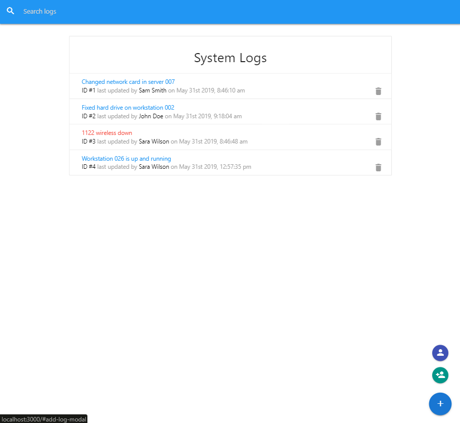

# React+Redux ITLogger App
> Based on https://www.udemy.com/modern-react-front-to-back
> React+Redux app to track IT department tasks and issues. Uses JSON-Server as a mock backend.

## Usage
* npm install
* npm run dev
* Runs the app with the backend JSON-Server
* Open http://localhost:3000 Server http://localhost:5000 db.json contains data

## What Was New
* Working with Redux
* Working with JSON server
* Working with Materialize